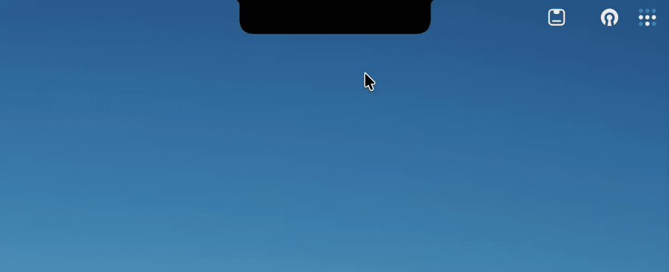

<h1 align="center">
  <br>
  Another Notch
  <br>
</h1>


<p align="center">
  <a title="Crowdin" target="_blank" href="https://crowdin.com/project/another-notch"></a>
  
</p>

Say hello to **Another Notch**, a polished way to make your MacBook’s notch useful. Music controls, calendar integration, file shelf with AirDrop support, HUD replacement, battery, and camera features all stay one hover away.

> **Upstream attribution:** Another Notch is a modified version of [TheBoredTeam’s original Boring Notch](https://github.com/TheBoredTeam/boring.notch). Original copyright and GPL-3.0 notices are retained. Last materially modified on August 23, 2026.

<p align="center">
  <a href="assets/another-notch-intro.mp4">
    
  </a>
</p>

---
## Installation

**System Requirements:**
- macOS **14 Sonoma** or later
- Apple Silicon or Intel Mac

---

### Download and Install Manually

[Download the latest release](https://github.com/jinkun1998/another.notch/releases/latest)

Once downloaded, open the `.dmg` and move **Another Notch** to your `/Applications` folder.

> [!IMPORTANT]
> I don't have an Apple Developer account (yet 👀), so macOS will warn you that Another Notch is from an unidentified developer on first launch. This is expected behavior.
>
> You'll need to bypass this before the app will open. You only need to do this once. Use the Terminal command below.

---

#### Recommended: Terminal (Always Works)

This is the quickest and easiest method. It only requires a single command and works consistently for all users. System Settings can sometimes fail and won't work for non-admin users.

After moving Another Notch to your Applications folder, run:

```bash
xattr -dr com.apple.quarantine /Applications/anotherNotch.app
```

Then open the app normally.

---

### Homebrew

Homebrew support is coming soon. Until then, install manually using the release above.

## Usage

- Launch the app, and voilà—your notch is now the coolest part of your screen.
- Hover over the notch to see it expand and reveal all its secrets.
- Use the controls to manage your music like a rockstar.
- Open Settings to customize the notch.

## Follow the Project

### Star History

<a href="https://star-history.com/#jinkun1998/another.notch&Date">
 <picture>
   <source media="(prefers-color-scheme: dark)" srcset="https://api.star-history.com/svg?repos=jinkun1998/another.notch&type=Date&theme=dark" />
   <source media="(prefers-color-scheme: light)" srcset="https://api.star-history.com/svg?repos=jinkun1998/another.notch&type=Date" />
   
 </picture>
</a>

### 📋 Roadmap

- [x] Playback live activity
- [x] Calendar integration with month & daily events
- [x] Reminders integration
- [x] Mirror & webcam preview
- [x] Charging indicator and battery status
- [x] Customizable gesture controls
- [x] Shelf functionality with drag-and-drop & AirDrop
- [x] Notch sizing & custom display heights
- [x] Dynamic Island fluid morph expansion and collapse
- [x] Liquid-glass edge and transparency controls
- [x] Modern macOS System Settings UI
- [x] System HUD replacements (volume, brightness, backlight)
- [ ] Bluetooth device live activity
- [ ] Lock screen widgets
- [ ] Extension system

## Building from Source

### Prerequisites

- **macOS 15.6 or later**
- **Xcode 26 or later**

### Installation

1. **Clone the Repository**:
   ```bash
   git clone https://github.com/jinkun1998/another.notch.git
   cd another.notch
   ```

2. **Open the Project in Xcode**:
   ```bash
   open anotherNotch.xcodeproj
   ```

3. **Build and Run**:
    - Click the "Run" button or press `Cmd + R`. Watch the magic unfold!

## Credits & Attribution

This project is based on [Boring Notch](https://github.com/TheBoredTeam/boring.notch) by [TheBoredTeam](https://github.com/TheBoredTeam). Original copyright and GPL-3.0 notices are retained.

Boring Notch is licensed under the GNU General Public License v3.0 (GPL-3.0).

This project has been substantially modified and developed independently from the original project. It is not affiliated with or endorsed by TheBoredTeam.

See the original repository for the original project and its license:
https://github.com/TheBoredTeam/boring.notch

For a full list of third-party licenses and attributions, please see the [Third-Party Licenses](./THIRD_PARTY_LICENSES.md) file.
